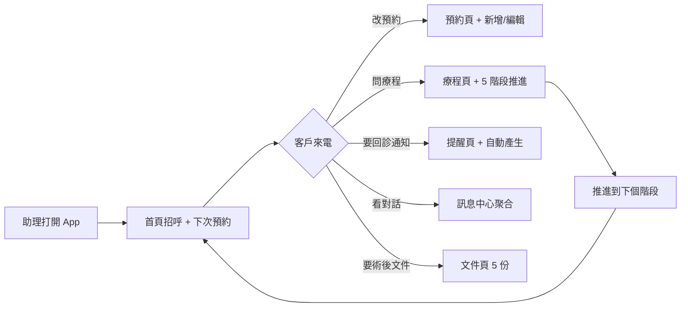

# clinic-booking · PRD v3.0.2 等級規格書

> 自動生成：2026-09-06（Sean 10-repo-fleet Batch 2B）
> 對齊 SPEC v3.0 契約（SPEC §1–§19 全部套用）

---

## 1. 產品概述

### 1.1 問題陳述
台灣中小型牙科 / 醫美診所每天有 20–50 筆預約。櫃台現場痛點：
- 助理用 LINE 群接單，無法統計「下週還有多少空檔」
- 療程（例：全瓷冠假牙）跨 5 個階段、3–6 個月，紙本病歷追蹤易掉
- 回診提醒靠櫃台手動打電話，平均漏 20% 回診率
- 客戶術後照護文件（咬棉卷注意事項、術後 24h 飲食指引等）每次都要重新印
- 診所跟客戶的對話散落在櫃台個人 LINE，離職交接困難

### 1.2 目標使用者
| Persona | 工作情境 | 主要任務 |
|---|---|---|
| Primary — 診所櫃台助理 | 一天接 30 通預約電話 + 排療程 | 5 秒內確認「王小明下週三下午 14:30」、3 秒內推進療程階段 |
| Secondary — 牙醫師 / 醫師 | 診間中快速查病患療程進度 | 一頁看到「目前階段 + 還剩幾次回診 + 病患 note」 |
| Tertiary — 病患 | 從診所接收預約通知、查療程 | 看見「下次回診 5/28 14:30」不漏診 |

### 1.3 核心價值主張
> 5 階段療程 + 2 筆預約 + 2 個回診提醒 + 5 則對話一頁看光，櫃台不必再翻 4 個 LINE 群。

### 1.4 Non-Goals（明確不做）
- ❌ 不做醫療 HIS / 病歷系統整合（MVP 鎖 mock data）
- ❌ 不做線上金流 / 刷卡（療程報價留 v2）
- ❌ 不做醫師排班 / 多人診所版（MVP 鎖單診所 + 單醫師 demo）
- ❌ 不做真實 LINE OA 推播（MVP 僅 mock + 訊息中心 UI）

---

## 2. 使用者場景與流程

### 2.1 使用者流程圖



### 2.2 主要場景

| 場景 | 輸入 | 輸出 | 成功條件 |
|---|---|---|---|
| 助理接預約電話 | 病患姓名 + 日期時間 | 新增到 appointments | localStorage 寫入 + 提醒自動產生 |
| 助理推進療程 | 療程 id | currentStage 切下個、completed++ | 5 階段狀態機正確切換 |
| 醫師查療程 | 病患姓名 | 顯示目前階段 + 還剩幾次 | 1 秒內讀到 5 階段進度 |
| 助理回覆客戶 | 對話 id | 訊息中心已讀標記 | unread false 寫回 localStorage |
| 助理下載術後文件 | 文件類型 | 5 份文件清單（PDF placeholder） | 4/5 顯示 ready |

---

## 3. 功能需求

| FR | 名稱 | 優先級 | 狀態 |
|---|---|---|---|
| FR-001 | 首頁招呼（含病患名） | P0 | ✅ shipped |
| FR-002 | 線上預約 + 編輯 | P0 | ✅ shipped |
| FR-003 | 療程追蹤 5 階段（初診→印模→試戴→黏著→追蹤） | P0 | ✅ shipped |
| FR-004 | 回診提醒 | P0 | ✅ shipped |
| FR-005 | 訊息中心（聚合所有病患對話） | P0 | ✅ shipped |
| FR-006 | 文件記錄（術後照護 5 份） | P0 | ✅ shipped |
| FR-007 | 預約列表頁 | P1 | ✅ shipped |
| FR-008 | 療程列表 + 推進按鈕 | P1 | ✅ shipped |
| FR-009 | 提醒列表頁 | P1 | ✅ shipped |
| FR-010 | 訊息已讀 / 未讀切換 | P1 | ✅ shipped |
| FR-011 | localStorage 持久化 + demo data seed | P1 | ✅ shipped |
| FR-012 | 公開靜態 dashboard.html（行銷 Landing） | P1 | ✅ shipped |
| FR-013 | 真實 LINE OA 整合 | P2 | ⏳ planned |
| FR-014 | 多醫師 / 多診所切換 | P2 | ⏳ planned |
| FR-015 | 線上金流（療程報價預付） | P2 | ⏳ planned |

---

## 4. Non-Functional Requirements

| 維度 | 需求 |
|---|---|
| Performance | 首頁 TTI < 1s（純前端 + localStorage） |
| Security | 無帳號、無 PII 加密；localStorage 僅 mock data |
| Privacy | 病患資料皆為示範（王小明 / 林心妍 / 陳柏志 / 黃小琪等虛構） |
| Accessibility | WCAG 2.1 AA |
| Browser | Modern evergreen（Chrome/Edge/Safari/Firefox 最新 2 版） |
| i18n | 繁中為主 |
| Offline | PWA-ready（無後端、localStorage 為主） |

---

## 5. 技術架構

```
┌──────────────────────────────────────┐
│ Vite 6 + React 19 + TypeScript 5.6   │
│ Tailwind 4 (CDN in dashboard.html)   │
│ React Router 7 (6 個 routes)          │
│ Vitest 2.1 + Testing Library         │
└──────────────────────────────────────┘
            ↓ build
        dist/
        ├── index.html       (redirect → dashboard.html)
        └── dashboard.html   (standalone static landing)
            ↓ deploy
   GitHub Pages (base: /clinic-booking/)
```

### 5.1 Module Map
- `web/src/App.tsx` — React Router 入口（6 routes）
- `web/src/pages/` — 6 個 page（Dashboard / Appointments / Treatments / Reminders / Messages / Documents）
- `web/src/components/Layout.tsx` — Header / Footer / Nav
- `web/src/lib/db.ts` — localStorage CRUD（treatments / appointments / reminders / chats）
- `web/src/lib/types.ts` — Treatment / Appointment / Reminder / ChatMessage（5 階段 TREATMENT_STAGES）
- `web/src/lib/bootstrap.ts` — 自動 seed demo data
- `web/public/dashboard.html` — 公開靜態 dashboard（行銷用途，CDN Tailwind）
- `web/tests/e2e.test.tsx` — 11 個 E2E 測試
- `web/tests/setup.ts` — jsdom + localStorage polyfill
- `dist/` — build 產物（gitignore）

### 5.2 環境變數
- 無（純前端 + localStorage + CDN Tailwind）

### 5.3 降級策略
- localStorage 不可用 → in-memory fallback
- CDN Tailwind 失敗 → 內嵌 utility
- 5 階段達終點（追蹤檢查）→ STAGE_NEXT 回傳 null，禁止推進

---

## 6. Definition of Done

- [x] 功能 P0 全部實作（6/6）
- [x] 單元/E2E 測試 11/11 pass
- [x] `npm run build` 綠（tsc strict + vite build）
- [x] `npm test` 11 passed
- [x] GHA CI 跑 4 jobs（lint/test/build/deploy）全綠
- [x] README + GOAL 反映現況

---

## 7. 部署契約

| 環境 | 目標 | 觸發 |
|---|---|---|
| Production | GitHub Pages | push to main |
| Preview | Per-PR | PR opened |

### 7.1 GHA Workflow
- `.github/workflows/ci.yml`
- jobs: lint / test / build / deploy
- deploy: `pages`（dist/ → GitHub Pages，base path `/clinic-booking/`）

### 7.2 環境變數
- 無需 server-side secret
- 全前端 + localStorage

---

## 8. Out of Scope（不做的）

- 不做帳號系統（診所內部工具）
- 不做付費牆（M1 SaaS MVP 展示版）
- 不做原生 App
- 不做多語系（繁中為主）
- 不做真實 LINE OA（mock only，留 v2）

---

## 9. 變更日誌

見 [`PRD/CHANGELOG.md`](PRD/CHANGELOG.md)
